# ccamlrgis (Python)

Unofficial Python port of the [CCAMLRGIS R
package](https://github.com/ccamlr/CCAMLRGIS) for producing maps and
spatial layers in the CAMLR Convention Area. Not a CCAMLR Secretariat
product; authoritative data remains at https://gis.ccamlr.org/ and
https://github.com/ccamlr/data. Original R package by Stephane
Thanassekos, Keith Reid, Lucy Robinson, Michael D. Sumner and Roger Bivand
(CCAMLR Secretariat) -- see `NOTICE`.

Status: all 41 functions from the R package are ported and validated
against real R output. See `PROGRESS.md` for the detailed work log,
`docs/r_to_python.md` for the full R-to-Python function/argument mapping,
and `docs/porting_notes.md` for every intentional behavioural deviation.

This document is a Python port of the R package's own `README.md` tutorial
-- same structure, same worked examples, translated to
`ccamlrgis`/`ccamlrgis.plot`. Every code block below is copied verbatim
from an executed, tested notebook under `notebooks/`; if you want to run
any of it yourself, start there rather than retyping it.

## Installation

```
pip install ccamlrgis          # core: create_*, load_*, analysis functions
pip install ccamlrgis[plot]    # + matplotlib, for ccamlrgis.plot
```

(Not yet published to PyPI -- for now, install from a checkout: `pip
install -e ".[plot]"`.)

## Introduction

```python
import ccamlrgis as cg
```

In order to plot bathymetry data, you will also need `rioxarray`, which is
already a core dependency (no separate install needed):

```python
import ccamlrgis.plot as cgplot  # optional -- the only module that imports matplotlib
```

All spatial manipulation happens in the South Pole Lambert Azimuthal Equal
Area projection, `ccamlrgis.CCAMLR_CRS` (`EPSG:6932`), and follows
CCAMLR's [geospatial
rules](https://github.com/ccamlr/geospatial_operations#1-geospatial-rules)
-- encoded as code, not just prose, in `ccamlrgis.validate.check_geospatial_rules`.

One deliberate asymmetry throughout this port: **function and argument
names are Python `snake_case`** (`create_polys`, `load_asds`,
`depth_classes=`), but **data column names inside the GeoDataFrames those
functions return keep R's original spelling** (`AreaKm2`, `Labx`, `Laby`,
`col`, `GAR_Short_Label`, ...). See `docs/r_to_python.md` for the full
mapping and the reasoning.

Unlike R's base graphics, nothing in this port ever draws as a side
effect. `create_*`/`load_*`/analysis functions return data
(GeoDataFrames, GeoSeries, dicts, rasters); `ccamlrgis.plot` is a
separate, optional layer you call explicitly to draw it.

## 1. Basemaps

A set of basic mapping elements, to show the core building blocks before
getting into the rest of the package. All examples below use the bundled
low-resolution bathymetry raster (`small_bathy()`); use `load_bathy()` for
higher-resolution data.

### Bathymetry

```python
import matplotlib.pyplot as plt
from matplotlib.colors import BoundaryNorm, ListedColormap

import ccamlrgis as cg
import ccamlrgis.plot as cgplot

depth_cmap = ListedColormap(cg.DEPTH_COLS)
depth_norm = BoundaryNorm(cg.DEPTH_CUTS, depth_cmap.N)

bathy = cg.load_bathy(res=5000)  # downloads and caches a 5km raster

fig, ax = cgplot.basemap(figsize=(8, 8))
bathy.plot(ax=ax, cmap=depth_cmap, norm=depth_norm, add_colorbar=False)
ax.set_title("")
plt.show()
```

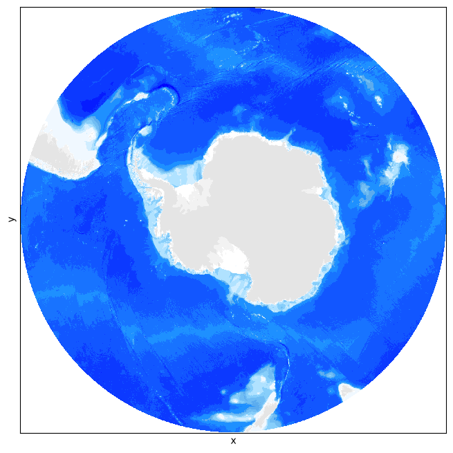

### Statistical Areas, Subareas and Divisions (ASDs)

```python
bathy_small = cg.small_bathy()
asds = cg.load_asds()
eezs = cg.load_eezs()
coast = cg.load_coastline()

fig, ax = cgplot.basemap(figsize=(9, 7.5))
bathy_small.plot(ax=ax, cmap=depth_cmap, norm=depth_norm, add_colorbar=False)
cgplot.add_reference_grid(ax=ax, res_lat=10, res_lon=20, lab_lon=0, fontsize=7.5)
cgplot.add_colour_scale(ax=ax, cuts=cg.DEPTH_CUTS, cols=cg.DEPTH_COLS, size="6%")
asds.boundary.plot(ax=ax, edgecolor="red", linewidth=0.75)
eezs.boundary.plot(ax=ax, edgecolor="red", linewidth=0.75)
coast.plot(ax=ax, color="grey", linewidth=0.01)
cgplot.add_labels(ax=ax, mode="auto", layer="ASDs", fontsize=6, colour="red")
ax.set_title("")
plt.show()
```

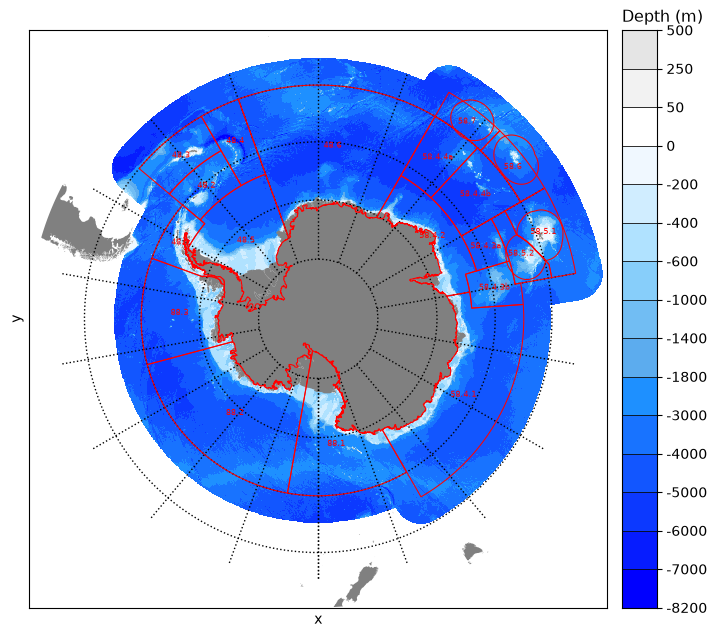

### Local map (e.g., Subarea 48.6)

```python
from ccamlrgis import datasets

s486 = asds[asds["GAR_Short_Label"] == "486"]
bathy_486 = bathy_small.rio.clip_box(*s486.total_bounds)
coast = datasets.load_example("Coast")   # bundled dataset, has a per-ASD 'ID' column
coast_486 = coast[coast["ID"] == "48.6"]
labels = datasets.load_example("Labels")

fig, ax = cgplot.basemap(figsize=(8, 6))
bathy_486.plot(ax=ax, cmap=depth_cmap, norm=depth_norm, add_colorbar=False)
cgplot.add_colour_scale(ax=ax, cuts=cg.DEPTH_CUTS, cols=cg.DEPTH_COLS, size="8%")
coast_486.plot(ax=ax, color="grey", linewidth=0.01)
cgplot.add_reference_grid(ax=ax, res_lat=5, res_lon=10, fontsize=7.5)
s486.boundary.plot(ax=ax, edgecolor="red", linewidth=1)
bathy_486.plot.contour(ax=ax, levels=[-2000], colors="black", linewidths=0.5)
lab486 = labels[labels["t"] == "48.6"]
ax.text(lab486["x"].iloc[0], lab486["y"].iloc[0], "48.6", color="red", fontsize=15, ha="center", va="center")
ax.set_title("")
plt.show()
```

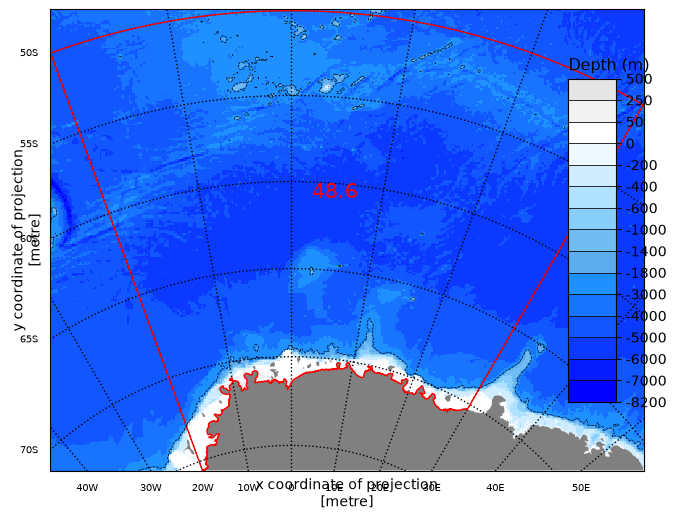

Full runnable version: `notebooks/01_basemaps.ipynb`.

## 2. Create functions

### 2.1. Points, lines, polygons and grids

These functions turn user data (a `pandas.DataFrame` of latitudes and
longitudes in decimal degrees, plus whatever else is relevant) into
projected spatial layers.

#### Create points

```python
from ccamlrgis import datasets

point_data = datasets.load_example("PointData")
line_data = datasets.load_example("LineData")
poly_data = datasets.load_example("PolyData")
grid_data = datasets.load_example("GridData")
coast_all = coast[coast["ID"] == "All"]

fig, axes = plt.subplots(2, 2, figsize=(8, 6))

# Example 1: simple points with labels
pts = cg.create_points(point_data)
ax = cgplot.basemap(ax=axes[0, 0])[1]
pts.plot(ax=ax, markersize=8, color="black")
for _, row in pts.iterrows():
    ax.annotate(row["name"], (row["x"], row["y"]), ha="center", va="bottom", fontsize=7)
ax.set_title("Example 1", fontsize=9)

# Example 2: highlight one group of points
pts = cg.create_points(point_data)
ax = cgplot.basemap(ax=axes[0, 1])[1]
pts.plot(ax=ax, markersize=8, color="black")
for _, row in pts.iterrows():
    ax.annotate(row["name"], (row["x"], row["y"]), ha="center", va="bottom", fontsize=7)
pts[pts["name"] == "four"].plot(ax=ax, markersize=25, color="red", edgecolor="black")
ax.set_title("Example 2", fontsize=9)

# Example 3: buffered points, radius proportional to catch
pts = cg.create_points(point_data, buffer=1 * point_data["Catch"])
ax = cgplot.basemap(ax=axes[1, 0])[1]
pts.plot(ax=ax, color="green")
for _, row in pts.iterrows():
    ax.annotate(row["name"], (row["x"], row["y"]), ha="center", va="center", fontsize=7)
ax.set_title("Example 3", fontsize=9)

# Example 4: buffered points clipped to the coast
pts = cg.create_points(point_data, buffer=2 * point_data["Catch"], clip=True)
ax = cgplot.basemap(ax=axes[1, 1])[1]
pts.plot(ax=ax, color="cyan")
coast_all.plot(ax=ax, color="grey", linewidth=0.5)
ax.set_title("Example 4", fontsize=9)

fig.tight_layout()
plt.show()
```

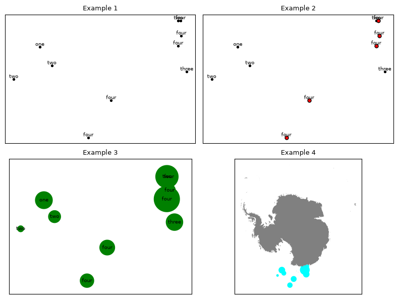

`buffer=` is in nautical miles; `clip=True` differences the result against
the coastline (`clip_to_coast()`, defaulting to the bundled `Coast`
dataset -- pass `coast=` for a different one, e.g. `load_coastline()`).

#### Create lines

```python
fig, axes = plt.subplots(1, 3, figsize=(9, 3.2))

# Example 1: simple, non-densified lines
lines = cg.create_lines(line_data)
ax = cgplot.basemap(ax=axes[0])[1]
lines.plot(ax=ax, cmap="rainbow", linewidth=2)
ax.set_title("Example 1", fontsize=9)

# Example 2: densified lines (note the curvature)
lines = cg.create_lines(line_data, densify=True)
ax = cgplot.basemap(ax=axes[1])[1]
lines.plot(ax=ax, cmap="rainbow", linewidth=2)
ax.set_title("Example 2", fontsize=9)

# Example 3: densified, buffered and clipped lines
lines = cg.create_lines(line_data, densify=True, buffer=[10, 40, 50, 80, 100], clip=True)
ax = cgplot.basemap(ax=axes[2])[1]
lines.iloc[::-1].plot(ax=ax, cmap="rainbow", linewidth=1)
coast_all.plot(ax=ax, color="grey", linewidth=0.5)
ax.set_title("Example 3", fontsize=9)

fig.tight_layout()
plt.show()
```

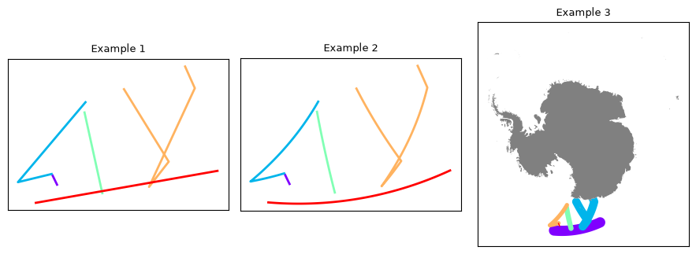

`densify=True` inserts extra vertices along great-circle paths (following
CCAMLR's densification geospatial rule) rather than plotting straight
lines in projected space -- that's the curvature in Example 2. Adding a
buffer with `separate_buffers=False` merges the result into a single
"footprint" polygon:

```python
merged = cg.create_lines(line_data, buffer=10, separate_buffers=False)
print("Buffered_AreaKm2:", merged["Buffered_AreaKm2"].iloc[0])

fig, ax = plt.subplots(figsize=(5, 3))
cgplot.basemap(ax=ax)
merged.plot(ax=ax, color="green")
plt.show()
```

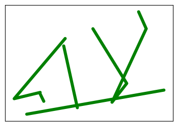

#### Create polygons

```python
fig, axes = plt.subplots(1, 3, figsize=(9, 3.6))

# Example 1: simple, non-densified polygons
polys = cg.create_polys(poly_data, densify=False)
ax = cgplot.basemap(ax=axes[0])[1]
polys.plot(ax=ax, color="blue")
for _, row in polys.iterrows():
    ax.annotate(row["ID"], (row["Labx"], row["Laby"]), ha="center", va="center", color="white", fontsize=7)
ax.set_title("Example 1", fontsize=9)

# Example 2: simple, densified polygons (note the curvature)
polys = cg.create_polys(poly_data)
ax = cgplot.basemap(ax=axes[1])[1]
polys.plot(ax=ax, color="red")
for _, row in polys.iterrows():
    ax.annotate(row["ID"], (row["Labx"], row["Laby"]), ha="center", va="center", color="white", fontsize=7)
ax.set_title("Example 2", fontsize=9)

# Example 3: buffered and clipped polygons
polys_before = cg.create_polys(poly_data, buffer=[10, -15, 120])
polys_after = cg.create_polys(poly_data, buffer=[10, -15, 120], clip=True)
ax = cgplot.basemap(ax=axes[2])[1]
polys_before.plot(ax=ax, color="green")
coast_all.plot(ax=ax, facecolor="none", edgecolor="black", linewidth=0.5)
polys_after.plot(ax=ax, color="orange")
for _, row in polys_after.iterrows():
    ax.annotate(row["ID"], (row["Labx"], row["Laby"]), ha="center", va="center", color="white", fontsize=7)
ax.set_title("Example 3", fontsize=9)

fig.tight_layout()
plt.show()
```

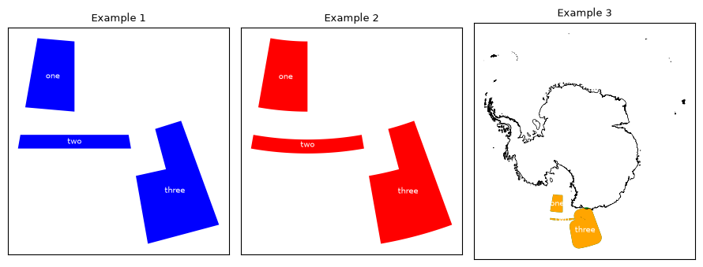

`create_polys` computes `AreaKm2`/`Labx`/`Laby` (centroid) automatically,
plus per-column min/max/mean/median/sum/count/sd summaries of any other
numeric columns in the input, grouped by ID.

```python
import pandas as pd

# Convention area: vertices given clockwise, starting from the NW corner of 48.3
ca = pd.DataFrame({
    "Name": ["CA"] * 8,
    "Lat": [-50, -50, -45, -45, -55, -55, -60, -60],
    "Lon": [-50, 30, 30, 80, 80, 150, 150, -50],
})

fig, axes = plt.subplots(1, 2, figsize=(7, 4))

# Example 4: Convention area contour
ca_poly = cg.create_polys(ca)
ax = cgplot.basemap(ax=axes[0])[1]
ca_poly.plot(ax=ax, color="blue", edgecolor="green", linewidth=2)
ax.set_title("Example 4", fontsize=9)

# Example 5: Convention area contour, coastline-clipped
ca_poly_clip = cg.create_polys(ca, clip=True)
ax = cgplot.basemap(ax=axes[1])[1]
ca_poly_clip.plot(ax=ax, color="blue", edgecolor="green", linewidth=2)
ax.set_title("Example 5", fontsize=9)

fig.tight_layout()
plt.show()
```

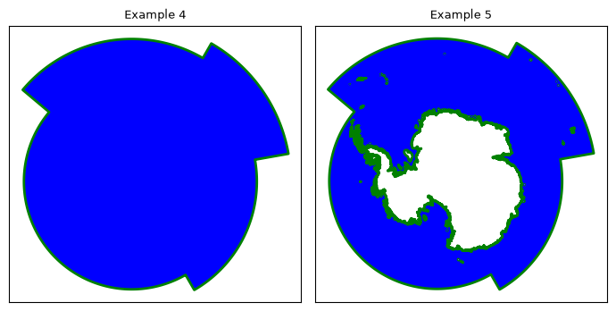

#### Create grids

An advanced demo is in `Advanced_Grids/Advanced_Grids.md` (R original) --
not yet ported (see `PROGRESS.md`).

```python
fig, axes = plt.subplots(1, 3, figsize=(9, 3))

# Example 1: simple grid, automatic colours
grid = cg.create_polygrids(grid_data, dlon=2, dlat=1)
ax = cgplot.basemap(ax=axes[0])[1]
grid.plot(ax=ax, color=grid["Col_Catch_sum"], linewidth=0.1)
ax.set_title("Example 1", fontsize=9)

# Example 2: equal-area grid, automatic colours
grid = cg.create_polygrids(grid_data, area=10000)
ax = cgplot.basemap(ax=axes[1])[1]
grid.plot(ax=ax, color=grid["Col_Catch_sum"], linewidth=0.1)
ax.set_title("Example 2", fontsize=9)

# Example 3: equal-area grid, custom cuts and colours
grid = cg.create_polygrids(grid_data, area=10000, cuts=[0, 50, 100, 500, 2000, 3500], cols=["blue", "red"])
ax = cgplot.basemap(ax=axes[2])[1]
grid.plot(ax=ax, color=grid["Col_Catch_sum"], linewidth=0.1)
ax.set_title("Example 3", fontsize=9)

fig.tight_layout()
plt.show()
```

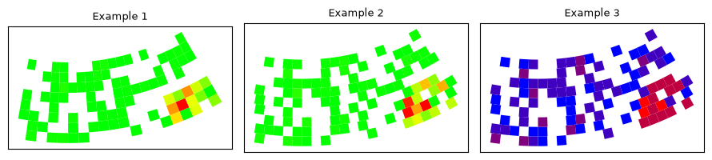

`dlon`/`dlat` grid in constant degrees; `area=` (km2) grids in constant
equal-area cells instead. Customizing a grid and adding a colour scale:

```python
# Step 1: generate the grid
grid = cg.create_polygrids(grid_data, area=10000)

# Step 2: inspect the gridded data to decide whether irregular cuts are needed
my_cuts = [0, 50, 100, 500, 2000, 2500]

fig, (ax_hist, ax_map) = plt.subplots(2, 1, figsize=(6, 8), gridspec_kw={"height_ratios": [1, 2]})
ax_hist.hist(grid["Catch_sum"], bins=100, color="grey")
for c in my_cuts:
    ax_hist.axvline(c, color="green", linestyle="--", linewidth=1)
ax_hist.set_title("Frequency distribution of data", fontsize=9)

# Step 3: generate colours for the desired classes
grid_col = cg.add_colour(grid["Catch_sum"], cuts=my_cuts, cols=["yellow", "purple"])

# Step 4: plot the result and add a colour scale
cgplot.basemap(ax=ax_map)
grid.plot(ax=ax_map, color=grid_col["varcol"], linewidth=0.1)
cgplot.add_colour_scale(ax=ax_map, cuts=grid_col["cuts"], cols=grid_col["cols"], title="Sum of Catch (t)", size="10%")

fig.tight_layout()
plt.show()
```

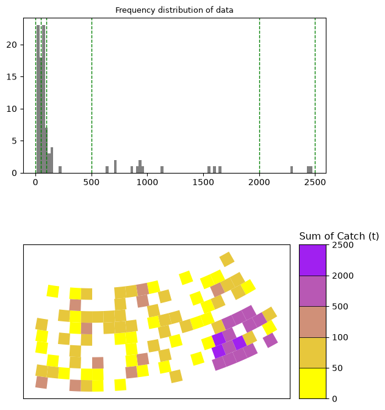

Full runnable version: `notebooks/02_create_functions.ipynb`.

### 2.2. Create Stations

Random point locations inside a polygon, stratified by bathymetry depth
range, with an optional minimum-distance constraint between stations. The
examples below use `small_bathy()` for illustration; use `load_bathy()`
for real survey design.

First, create a polygon within which stations will be created:

```python
my_poly_df = pd.DataFrame({
    "Name": ["mypol"] * 4,
    "Latitude": [-75, -75, -70, -70],
    "Longitude": [-170, -180, -180, -170],
})
my_poly = cg.create_polys(my_poly_df, densify=True)
coast_881 = coast[coast["ID"] == "88.1"]

fig, ax = plt.subplots(figsize=(8, 4))
cgplot.basemap(ax=ax)
coast_881.plot(ax=ax, color="grey")
my_poly.plot(ax=ax, color="green")
for _, row in my_poly.iterrows():
    ax.annotate(row["ID"], (row["Labx"], row["Laby"]), ha="center", va="center")
plt.show()
```

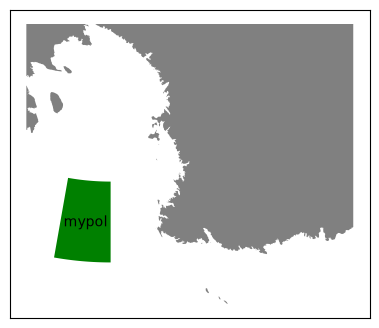

**Example 1.** Set numbers of stations, no distance constraint:

```python
bathy_crop = bathy_small.rio.clip_box(*my_poly.total_bounds)  # optional: crop to the polygon's extent
my_cols = cg.add_colour([-10000, 10000], cuts=[-2000, -1500, -1000, -550], cols=["blue", "cyan"])
strata_cmap = ListedColormap(my_cols["cols"])
strata_norm = BoundaryNorm(my_cols["cuts"], strata_cmap.N)

stations1 = cg.create_stations(my_poly, bathy_crop, depths=[-2000, -1500, -1000, -550], n=[20, 15, 10], seed=1)

fig, ax = plt.subplots(figsize=(8, 6))
cgplot.basemap(ax=ax)
bathy_crop.plot(ax=ax, cmap=strata_cmap, norm=strata_norm, add_colorbar=False)
cgplot.add_colour_scale(ax=ax, cuts=my_cols["cuts"], cols=my_cols["cols"], size="8%")
my_poly.boundary.plot(ax=ax, edgecolor="red", linewidth=2)
stations1.plot(ax=ax, marker="+", color="orange")
plt.show()
```

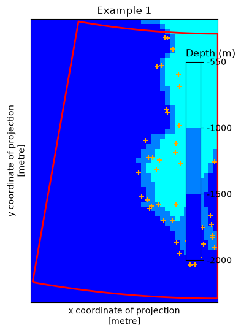

R has no seeding -- station picking uses R's global RNG. This port adds
`rng=`/`seed=` (a Python-only addition, since reproducibility is a real
win here) so results are reproducible; pass a `numpy.random.Generator` via
`rng=` or an int via `seed=`.

**Example 2.** Set numbers of stations, with a distance constraint:

```python
stations2 = cg.create_stations(
    my_poly, bathy_crop, depths=[-2000, -1500, -1000, -550], n=[20, 15, 10], dist=10, seed=1
)

fig, ax = plt.subplots(figsize=(8, 6))
cgplot.basemap(ax=ax)
bathy_crop.plot(ax=ax, cmap=strata_cmap, norm=strata_norm, add_colorbar=False)
cgplot.add_colour_scale(ax=ax, cuts=my_cols["cuts"], cols=my_cols["cols"], size="8%")
my_poly.boundary.plot(ax=ax, edgecolor="red", linewidth=2)
for stratum, colour in [("1000-550", "yellow"), ("1500-1000", "orange"), ("2000-1500", "red")]:
    stations2[stations2["Stratum"] == stratum].plot(ax=ax, marker="o", color=colour, edgecolor="black", markersize=20)
plt.show()
```

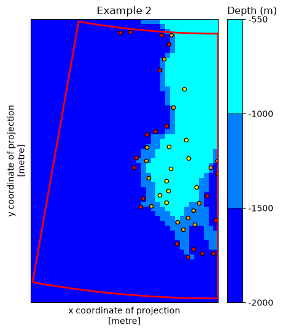

**Example 3.** Automatic numbers of stations (`n_auto=`, proportional to
each stratum's area), with a distance constraint:

```python
stations3 = cg.create_stations(
    my_poly, bathy_crop, depths=[-2000, -1500, -1000, -550], n_auto=30, dist=10, seed=1
)
```

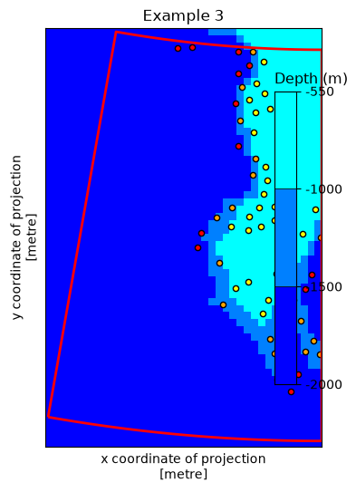

### 2.3. Create pies

`create_pies()` generates pie-chart polygons for overlaying on a map: one
pie per location, slices sized by each class's share of the total.
Optionally, pie *area* can be made proportional to another variable
(`size_var=`); nearby locations can be aggregated onto a grid
(`grid_km=`). `add_pie_legend()` adds a legend showing the classes and
colours used.

```python
pie_data = datasets.load_example("PieData")
pie_data2 = datasets.load_example("PieData2")

asds = cg.load_asds()
s486 = asds[asds["GAR_Short_Label"] == "486"]
bathy_486 = bathy_small.rio.clip_box(*s486.total_bounds)
coast_486 = coast[coast["ID"] == "48.6"]
```

**Example 1.** Pies of constant size, all classes displayed:

```python
fig, ax = plt.subplots(figsize=(8, 6))
cgplot.basemap(ax=ax)
bathy_486.plot(ax=ax, cmap=depth_cmap, norm=depth_norm, add_colorbar=False)
coast_486.plot(ax=ax, color="grey", linewidth=0.01)
pies = cg.create_pies(pie_data, names_in=["Lat", "Lon", "Sp", "N"], size=50)
pies.plot(ax=ax, color=list(pies["col"]))
cgplot.add_pie_legend(ax=ax, pies=pies, title="Species")
plt.show()
```

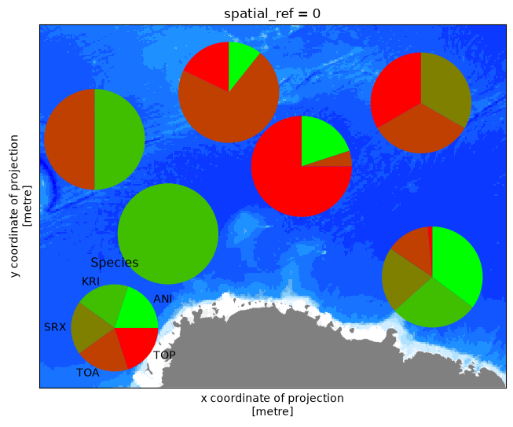

**Example 2.** Selected classes only (`classes=`, everything else folds
into `"Other"`):

```python
pies = cg.create_pies(pie_data, names_in=["Lat", "Lon", "Sp", "N"], size=50, classes=["TOP", "TOA", "ANI"])
```

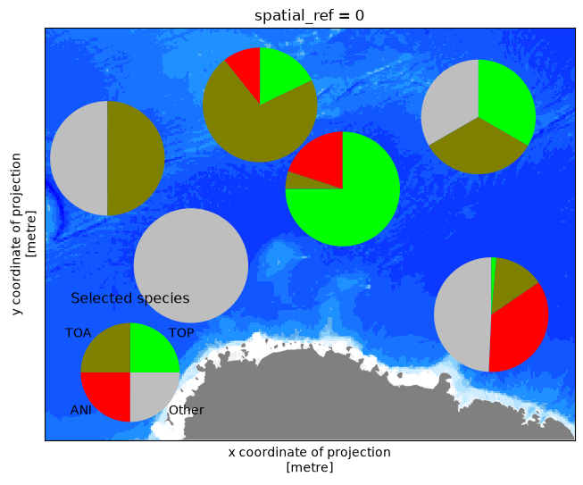

**Example 3.** Proportions below 25% grouped into `"Other"` (`other=25`)
-- note this "Other" can include classes that are shown individually in
the legend, unlike Example 2's `classes=`:

```python
pies = cg.create_pies(pie_data, names_in=["Lat", "Lon", "Sp", "N"], size=50, other=25)
```

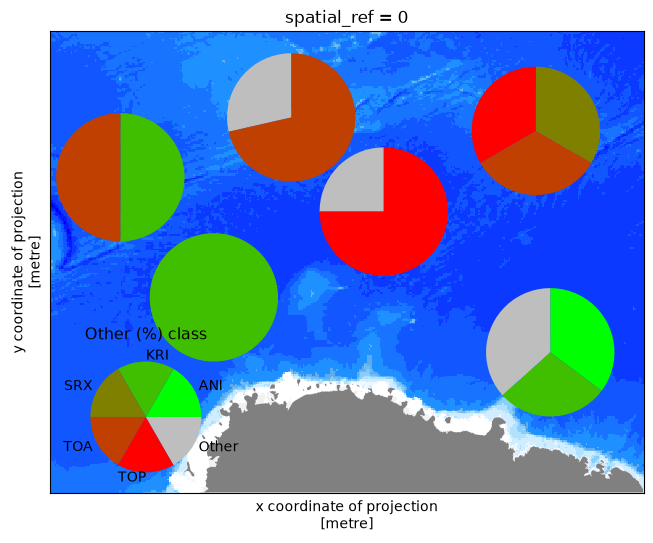

**Example 4.** Pie area proportional to `'Catch'`:

```python
pies = cg.create_pies(pie_data, names_in=["Lat", "Lon", "Sp", "N"], size=18, size_var="Catch")
```

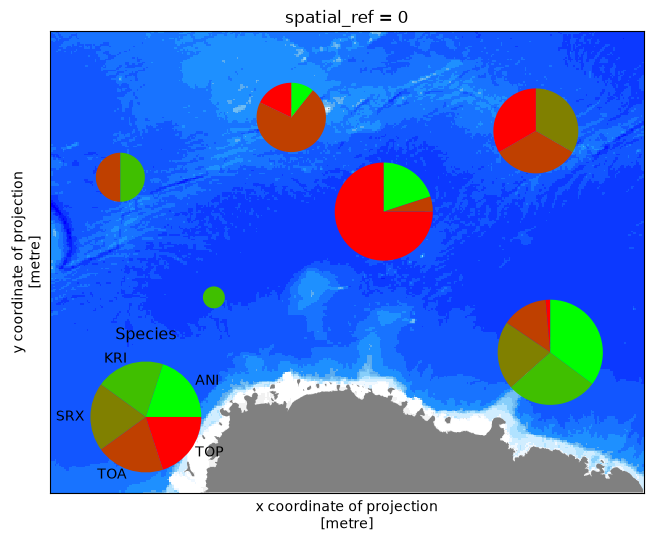

**Example 5.** Same pies, legend placed elsewhere (`add_pie_legend`'s
`loc=` -- this port's replacement for R's pixel-offset `PosX`/`PosY`):

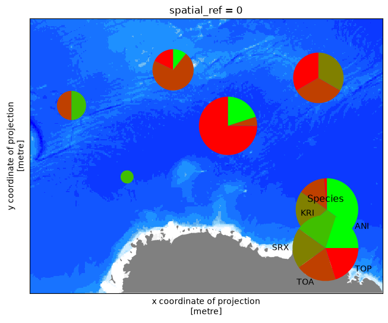

**Example 6.** Too many pies -- classes get crowded and unreadable:

```python
pies = cg.create_pies(pie_data2, names_in=["Lat", "Lon", "Sp", "N"], size=5)
```

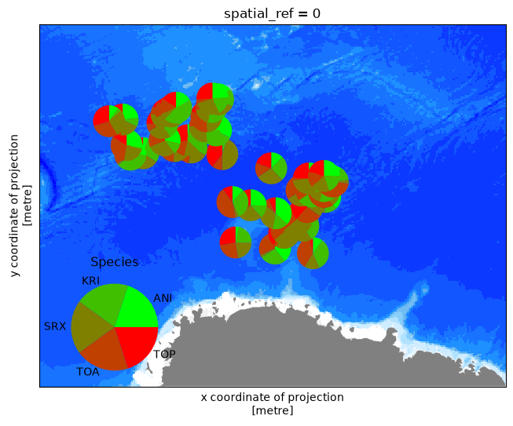

**Example 7.** Same data, gridded (`grid_km=250` aggregates nearby
locations, summing numeric values per grid cell):

```python
pies = cg.create_pies(pie_data2, names_in=["Lat", "Lon", "Sp", "N"], size=5, grid_km=250)
```

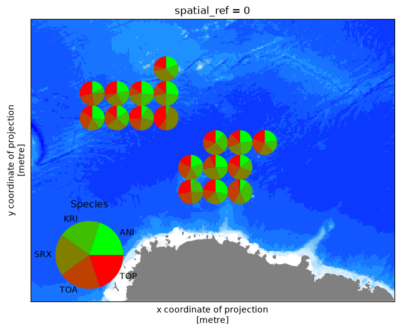

**Example 8.** Gridded, with pie area proportional to `'Catch'`:

```python
pies = cg.create_pies(pie_data2, names_in=["Lat", "Lon", "Sp", "N"], size=3, grid_km=250, size_var="Catch")
```

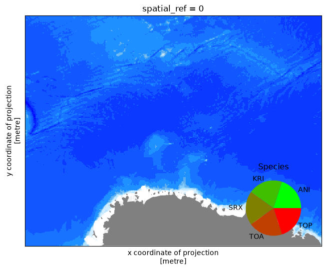

`add_pie_legend` (this port) only draws the classes legend, not R's
optional pie-*size* legend (`SizeTitle=`) -- see `docs/porting_notes.md`.

### 2.4. Create Arrow

Creates an arrow, possibly curved (via intermediate "bend" points with
optional weights) and/or segmented ("dashed", with a colour/transparency
gradient). Input is a table of Latitude/Longitude (+ optional weight); the
first row is the start, the last is the tip.

**Examples 1-4:**

```python
asds_481_3 = asds[asds["GAR_Short_Label"].isin(["481", "482", "483"])]
coast_481_3 = coast[coast["ID"].isin(["48.1", "48.2", "48.3"])]

arrow_specs = [
    (pd.DataFrame({"lat": [-61, -52], "lon": [-60, -40]}), {}),
    (pd.DataFrame({"lat": [-61, -65, -52], "lon": [-60, -45, -40]}), {"colour": "lightblue"}),
    (pd.DataFrame({"lat": [-61, -60, -65, -52], "lon": [-60, -50, -45, -40]}), {"colour": "lightblue"}),
    (
        pd.DataFrame({"lat": [-61, -60, -65, -52], "lon": [-60, -50, -45, -40], "w": [1, 1, 2, 1]}),
        {"colour": "lightblue", "hlength": 20, "hwidth": 20},
    ),
]

fig, axes = plt.subplots(2, 2, figsize=(8, 8))
for ax, (inp, kwargs), title in zip(axes.flat, arrow_specs, [f"Example {i}" for i in range(1, 5)]):
    arrow = cg.create_arrow(inp, **kwargs)
    cgplot.basemap(ax=ax)
    asds_481_3.boundary.plot(ax=ax, color="black", linewidth=0.75)
    coast_481_3.plot(ax=ax, color="grey")
    arrow.plot(ax=ax, color=list(arrow["col"]))
    ax.set_title(title, fontsize=9)
fig.tight_layout()
plt.show()
```

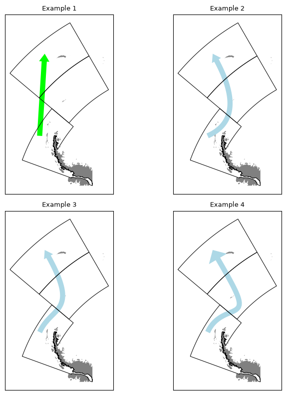

**Examples 5-8** (`arrow_type="dashed"`, `dlength=` controls dash length,
`colour=`/`transparency=` accept lists for a gradient):

```python
inp = pd.DataFrame({"lat": [-61, -60, -65, -52], "lon": [-60, -50, -45, -40], "w": [1, 1, 2, 1]})
dashed_specs = [
    {"colour": "blue", "arrow_type": "dashed", "dlength": 1},
    {"colour": "blue", "arrow_type": "dashed", "dlength": 2},
    {"colour": ["red", "green", "blue"], "transparency": [0, 0.9, 0], "arrow_type": "dashed", "dlength": 0},
    {
        "n_points": 200,
        "colour": ["red", "green", "blue"],
        "transparency": [0, 0.9, 0],
        "arrow_type": "dashed",
        "dlength": 0,
    },
]

fig, axes = plt.subplots(2, 2, figsize=(8, 8))
for ax, kwargs, title in zip(axes.flat, dashed_specs, [f"Example {i}" for i in range(5, 9)]):
    arrow = cg.create_arrow(inp, **kwargs)
    cgplot.basemap(ax=ax)
    asds_481_3.boundary.plot(ax=ax, color="black", linewidth=0.75)
    coast_481_3.plot(ax=ax, color="grey")
    arrow.plot(ax=ax, color=list(arrow["col"]), edgecolor="none")
    ax.set_title(title, fontsize=9)
fig.tight_layout()
plt.show()
```

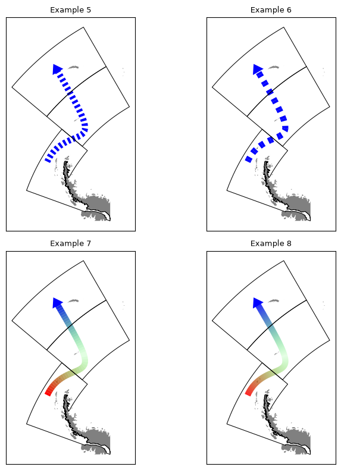

**Example 9** composes several arrows over a local map built from the live
`load_coastline()` (rather than the bundled `Coast` dataset used
elsewhere), matching the R tutorial's own choice here:

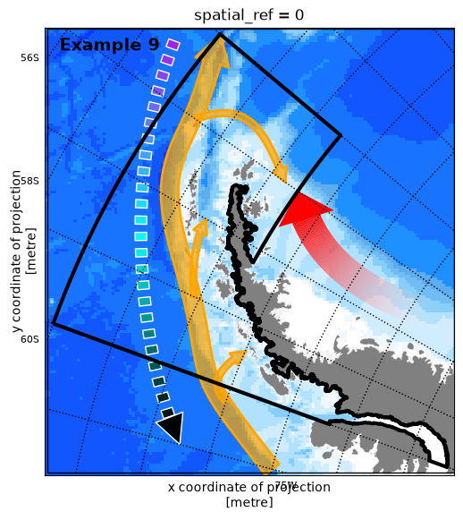

**Example 10** follows a path along the -1000m isobath -- extracted with
matplotlib's own `contour()` rather than R's `terra::as.contour` (no new
dependency):

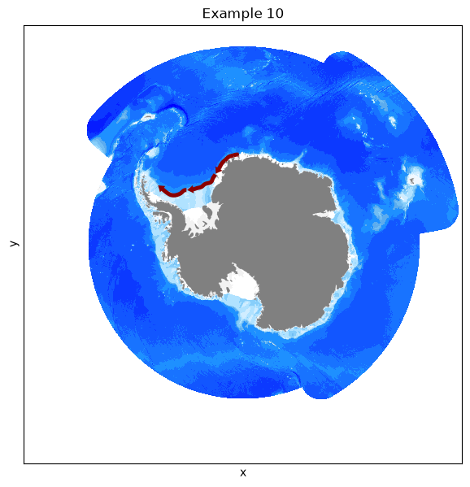

Full code for Examples 9-10: `notebooks/03_stations_pies_arrows.ipynb`.

### 2.5. Create Hashes

`create_hashes()` fills a polygon with hatching lines, as real geometry
(not a plot style) -- returned as a `GeoSeries` to overlay on a plot.

```python
asds_full = cg.load_asds()
n = len(asds_full)
import numpy as np
colours_h = plt.cm.hsv(np.linspace(0, 1, n, endpoint=False))
angles = np.linspace(10, 355, n)
spacings = np.linspace(3, 10, n)
widths = np.linspace(3, 10, n)

fig, ax = plt.subplots(figsize=(8, 8))
cgplot.basemap(ax=ax)
asds_full.plot(ax=ax, color="white")
for i in range(n):
    h = cg.create_hashes(asds_full.iloc[[i]], angle=angles[i], spacing=spacings[i], width=widths[i])
    h.plot(ax=ax, color=colours_h[i])
asds_full.boundary.plot(ax=ax, color="black", linewidth=2)
plt.show()
```

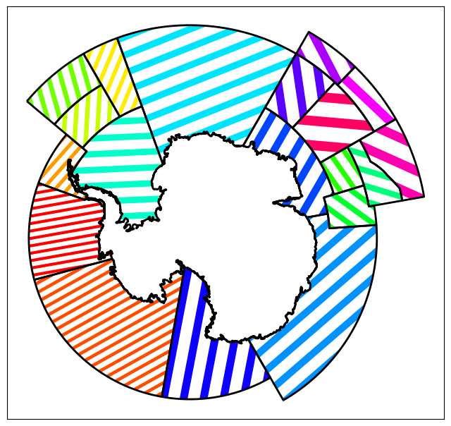

### 2.6. Create Ellipse

```python
el1 = cg.create_ellipse(latc=-61, lonc=-50, lmaj=500, lmin=250, ang=120)
el2 = cg.create_ellipse(latc=-72, lonc=-30, lmaj=500, lmin=500)
hash_el2 = cg.create_hashes(el2, spacing=2, width=2)
el3 = cg.create_ellipse(latc=-68, lonc=-55, lmaj=400, lmin=100, ang=35)

fig, ax = plt.subplots(figsize=(7, 7))
cgplot.basemap(ax=ax, xlim=(-3e6, 0), ylim=(0, 3e6))
bathy_small.plot(ax=ax, cmap=depth_cmap, norm=depth_norm, add_colorbar=False)
coast_all.plot(ax=ax, color="grey")
el1.plot(ax=ax, color=(0, 1, 0.5, 0.5), linewidth=2)
el3.plot(ax=ax, color=(0, 0.5, 0.5, 0.5), edgecolor="orange", linewidth=2)
hash_el2.plot(ax=ax, color="red", edgecolor="none")
plt.show()
```


### 2.7. Create Circular Arrow

One or more arrows along an elliptical (default: a simplified Weddell Sea
gyre) or custom path.

**Examples 1-4:**

```python
circ_specs = [
    {},
    {"n_arrows": 2, "spacing": 5},
    {"n_arrows": 10, "spacing": -4, "hwidth": 15, "hlength": 20},
    {
        "n_arrows": 8, "spacing": -2, "n_points_arrow": 200,
        "colour": ["red", "orange", "green"], "transparency": [0, 0.9, 0], "arrow_type": "dashed",
    },
]

fig, axes = plt.subplots(2, 2, figsize=(8, 8))
for ax, kwargs, title in zip(axes.flat, circ_specs, [f"Example {i}" for i in range(1, 5)]):
    arrow = cg.create_circular_arrow(**kwargs)
    cgplot.basemap(ax=ax, xlim=(-3e6, 0), ylim=(0, 3e6))
    bathy_small.plot(ax=ax, cmap=depth_cmap, norm=depth_norm, add_colorbar=False)
    coast_all.plot(ax=ax, color="grey")
    arrow.plot(ax=ax, color=list(arrow["col"]), edgecolor="none")
    ax.set_title(title, color="grey", fontsize=9)
fig.tight_layout()
plt.show()
```

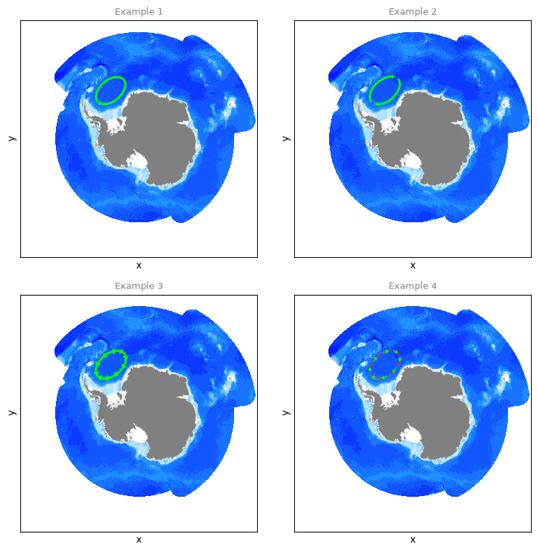

**Example 5** (path around the convex hull of two ellipses, via `input=`):

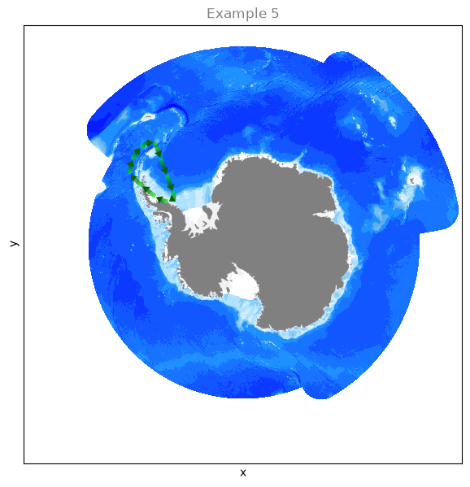

**Example 6** (path along an isobath):

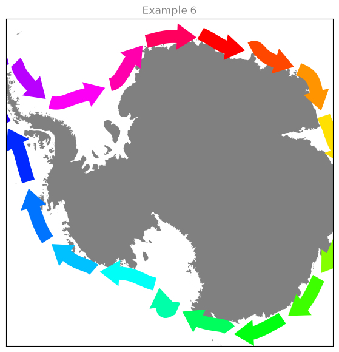

Full code for Examples 5-6: `notebooks/03_stations_pies_arrows.ipynb`. (R's
README also has a 10-frame GIF animation combining `create_CircularArrow`
and `Rotate_obj` -- out of scope for a static tutorial; skipped here.)

## 3. Load functions

### 3.1. Online use

```python
asds = cg.load_asds()
eezs = cg.load_eezs()
coastline = cg.load_coastline()
coastline = coastline[coastline["surface"] == "Land"]

fig, ax = plt.subplots(figsize=(7, 7))
cgplot.basemap(ax=ax)
asds.plot(ax=ax, color="green", edgecolor="blue")
eezs.plot(ax=ax, color="orange", edgecolor="purple")
coastline.plot(ax=ax, color="grey")
cgplot.add_labels(ax=ax, mode="auto", layer="ASDs", fontsize=7.5, colour="red")
plt.show()
```

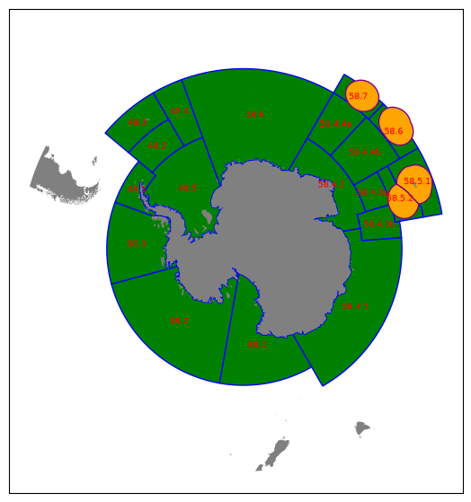

### 3.2. Offline use

R's offline workflow is: load each layer once while online, `save()` them
to a local `.RData` file, then `load()` that file on subsequent, possibly
offline, runs. `ccamlrgis`'s `load_*` functions do this automatically --
every call is cached to disk (`ccamlrgis.cache`, ETag-conditional so it
only re-downloads when the source has actually changed), so there's no
separate save/load step:

```python
from ccamlrgis import cache

cache.prefetch()   # download everything up front, e.g. before going offline
cache.info()        # what's already cached, and from when
```

`load_bathy()` may also be used ahead of time to cache bathymetry data for
offline use.

## 4. Other functions

### 4.1. get_depths

Samples a bathymetry raster's depth at point locations (nearest-cell
value, matching `terra::extract`'s default -- no interpolation).

```python
my_data = point_data[["Lat", "Lon", "Catch"]]
my_data_d = cg.get_depths(my_data, bathy_small)   # adds a 'd' (depth) column

fig, ax = plt.subplots(figsize=(6, 4))
ax.scatter(my_data_d["d"], my_data_d["Catch"], facecolor="red", edgecolor="black")
ax.set_xlabel("Depth")
ax.set_ylabel("Catch")
plt.show()
```

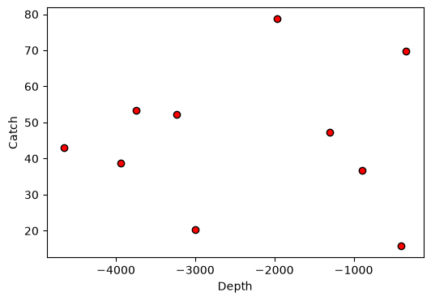

### 4.2. seabed_area

Planimetric seabed area within polygons and depth strata, in km2:

```python
my_polys = cg.create_polys(poly_data, densify=True)
# Note the 600-1800 stratum is renamed 'Fishable_area', matching R
fish_depth = cg.seabed_area(bathy_small, my_polys, poly_names="ID", depth_classes=[0, -200, -600, -1800, -3000, -5000])
```

### 4.3. assign_areas

Given point locations and a set of polygons, finds which polygon each
location falls in (e.g. which ASD/SSRU a fishing event occurred in):

```python
import numpy as np

rng = np.random.default_rng(0)
my_data = pd.DataFrame({"Lat": rng.uniform(-65, -50, 100), "Lon": rng.uniform(20, 40, 100)})

ssrus = cg.load_ssrus()
my_data = cg.assign_areas(my_data, polys={"ASDs": asds, "SSRUs": ssrus}, names_out=["MyASDs", "MySSRUs"])
my_data["MyASDs"].value_counts()
```

R's `Polys=` is a character vector naming objects in the caller's global
environment, looked up via `get()` -- there's no safe Python equivalent, so
`polys=` here is a `dict` mapping names directly to GeoDataFrames instead
(`docs/porting_notes.md`).

### 4.4. project_data

Projects Lat/Lon locations to the CCAMLR CRS (or back-projects Y/X to
Lat/Lon with `inverse=True`):

```python
my_data = cg.project_data(point_data, names_in=["Lat", "Lon"], names_out=["Projected_Y", "Projected_X"], append=True)
```

### 4.5. get_C_intersection

Cartesian (planar, not geodesic) intersection of two lines, each given as
`[lon_start, lat_start, lon_end, lat_end]`:

```python
def plot_intersection(ax, line1, line2, title):
    x1, y1, x2, y2 = line1
    x3, y3, x4, y4 = line2
    result = cg.get_c_intersection(line1, line2)
    ax.plot([x1, x2], [y1, y2], marker="o")
    ax.plot([x3, x4], [y3, y4], marker="o")
    ax.plot(result["Lon"], result["Lat"], marker="x", color="red", markersize=12, markeredgewidth=2)
    ax.set_title(title, fontsize=9)


fig, axes = plt.subplots(2, 2, figsize=(8, 7))
plot_intersection(axes[0, 0], [-30, -55, -29, -50], [-50, -60, -40, -60], "Example 1")   # beyond the segments
plot_intersection(axes[0, 1], [-30, -65, -29, -50], [-50, -60, -40, -60], "Example 2")   # on a segment
plot_intersection(axes[1, 0], [-30, -65, -29, -50], [-50, -60, -25, -60], "Example 3")   # crossed segments
plot_intersection(axes[1, 1], [-179, -60, -150, -50], [-120, -60, -130, -62], "Example 4")  # antimeridian
fig.tight_layout()
plt.show()
```

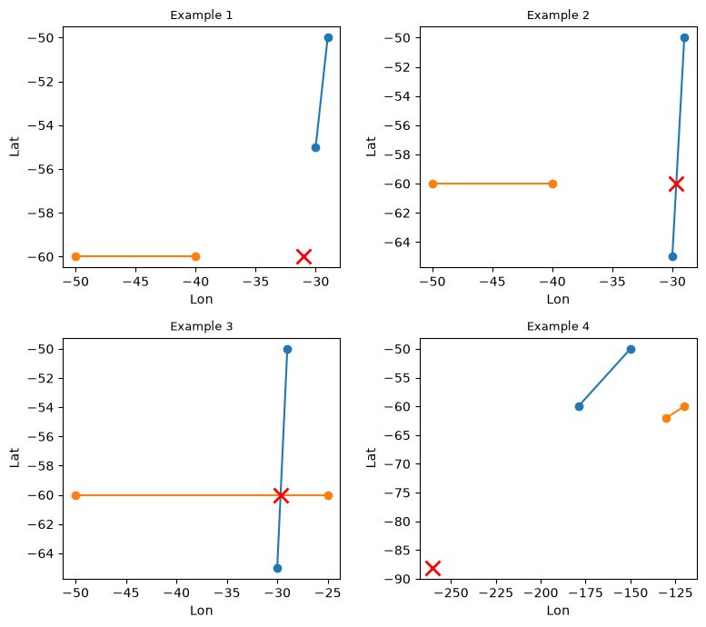

`get_c_intersection` (this port) returns `{"Lon", "Lat"}` and never plots
as a side effect -- the diagram above is built from that return value.

### 4.6. get_iso_polys

Turns a raster and a set of cuts (classes) into filled contour-band
polygons, optionally constrained to a polygon:

```python
from matplotlib.colors import to_hex

fig, axes = plt.subplots(1, 3, figsize=(11, 4))

# Example 1: whole Convention Area
iso_pols = cg.get_iso_polys(bathy_small, cuts=[-10000, -4000, -2000, 0], cols=["blue", "white", "red"])
ax = cgplot.basemap(ax=axes[0])[1]
iso_pols.plot(ax=ax, color=list(iso_pols["c"]))
ax.set_title("Example 1", fontsize=9)

# Example 2: SSRU 882H seamounts -- grp=True groups touching contour polygons (e.g. seamounts spanning several isobaths)
ssrus = cg.load_ssrus()
poly_882h = ssrus[ssrus["GAR_Short_Label"] == "882H"]
iso_pols2 = cg.get_iso_polys(bathy_small, poly=poly_882h, cuts=[-2500, -1800, -600], cols=["cyan", "green"], grp=True)
ax = cgplot.basemap(ax=axes[1])[1]
iso_pols2.plot(ax=ax, color=list(iso_pols2["c"]))
for _, row in iso_pols2.iterrows():
    ax.annotate(row["Grp"], (row["Labx"], row["Laby"]), color="red", fontweight="bold", fontsize=10)
ax.set_title("Example 2", fontsize=9)

# Example 3: custom polygon
poly3 = cg.create_polys(pd.DataFrame({"ID": [1] * 4, "Lat": [-55, -55, -61, -61], "Lon": [-30, -25, -25, -30]}))
rainbow9 = [to_hex(c) for c in plt.cm.hsv(np.linspace(0, 1, 9, endpoint=False))]
iso_pols3 = cg.get_iso_polys(bathy_small, poly=poly3, cuts=np.linspace(-8000, 0, 10), cols=rainbow9)
ax = cgplot.basemap(ax=axes[2])[1]
poly3.boundary.plot(ax=ax, color="black")
iso_pols3.plot(ax=ax, color=list(iso_pols3["c"]))
ax.set_title("Example 3", fontsize=9)

fig.tight_layout()
plt.show()
```

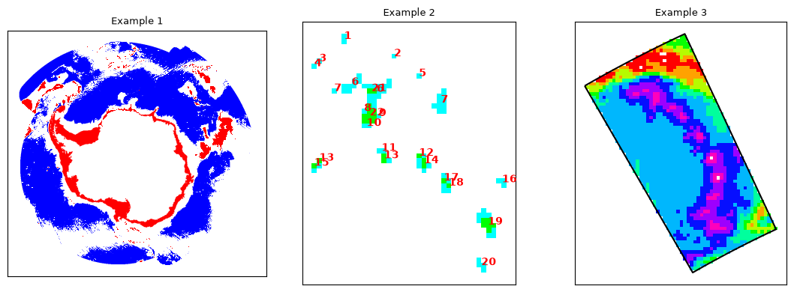

R's `isoband`-based smooth contours are replaced with
`rasterio.features.shapes` on a classified array -- boundaries follow
raster cell edges (blocky) rather than being interpolated; see
`docs/porting_notes.md`.

### 4.7. rotate_obj

Rotates a vector or raster object so a chosen longitude points up. For
plotting only, not analysis (the resulting projection is non-standard, so
distances/areas computed after rotation aren't meaningful):

```python
rotated = cg.rotate_obj(bathy_small, lon0=90)

fig, ax = plt.subplots(figsize=(6, 6))
cgplot.basemap(ax=ax)
rotated.plot(ax=ax, cmap=depth_cmap, norm=depth_norm, add_colorbar=False)
cgplot.add_reference_grid(ax=ax, res_lat=10, res_lon=20, lab_lon=90)
plt.show()
```

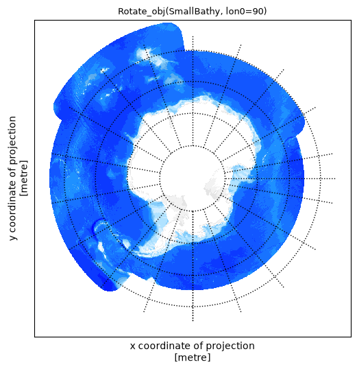

(R's README shows this as a 19-frame rotating GIF; the single frame above
stands in for it.)

## 5. Adding colours, legends and labels

### 5.1. Bathymetry colours

Two bundled colour sets: `DEPTH_COLS`/`DEPTH_CUTS` (simple shades of
blue), and `DEPTH_COLS2`/`DEPTH_CUTS2` (adds shades of green to highlight
the Fishable Depth range, 600-1800m).

```python
fig, ax = plt.subplots(figsize=(7, 6))
cgplot.basemap(ax=ax)
bathy_small.plot(ax=ax, cmap=depth_cmap, norm=depth_norm, add_colorbar=False)
cgplot.add_colour_scale(ax=ax, cuts=cg.DEPTH_CUTS, cols=cg.DEPTH_COLS, size="8%")
plt.show()
```

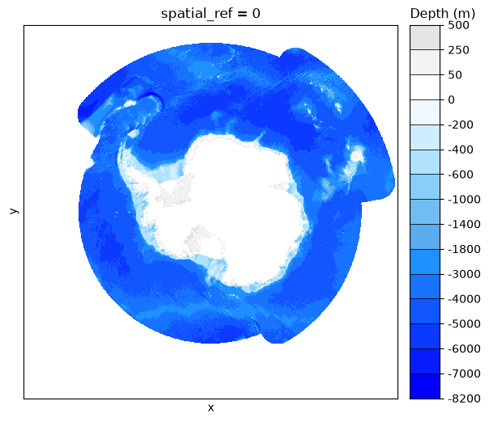

```python
depth_cmap2 = ListedColormap(cg.DEPTH_COLS2)
depth_norm2 = BoundaryNorm(cg.DEPTH_CUTS2, depth_cmap2.N)

fig, ax = plt.subplots(figsize=(7, 6))
cgplot.basemap(ax=ax)
bathy_small.plot(ax=ax, cmap=depth_cmap2, norm=depth_norm2, add_colorbar=False)
cgplot.add_colour_scale(ax=ax, cuts=cg.DEPTH_CUTS2, cols=cg.DEPTH_COLS2, size="8%")
plt.show()
```

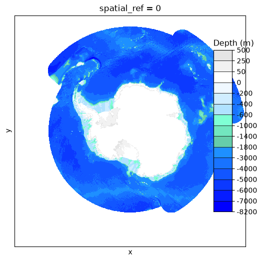

### 5.2. Adding colours to data

`add_colour()` maps a numeric variable to colours -- either `cuts=` many
equally-spaced classes, or an explicit sequence of breakpoints -- and
returns `cuts`/`cols` for `add_colour_scale()` to draw a matching legend.

```python
my_points = cg.create_points(point_data)

fig, axes = plt.subplots(3, 1, figsize=(6, 12))

# Example 1: default cuts and colours
my_cols = cg.add_colour(my_points["Nfishes"])
ax = cgplot.basemap(ax=axes[0])[1]
my_points.plot(ax=ax, color=list(my_cols["varcol"]), markersize=40, edgecolor="black", linewidth=0.5)
cgplot.add_colour_scale(ax=ax, cuts=my_cols["cuts"], cols=my_cols["cols"], title="Number of fishes", size="8%")
ax.set_title("Example 1", fontsize=9)

# Example 2: fewer cuts
my_cols = cg.add_colour(my_points["Nfishes"], cuts=10)
ax = cgplot.basemap(ax=axes[1])[1]
my_points.plot(ax=ax, color=list(my_cols["varcol"]), markersize=40, edgecolor="black", linewidth=0.5)
cgplot.add_colour_scale(ax=ax, cuts=np.round(my_cols["cuts"], 1), cols=my_cols["cols"], title="Number of fishes", size="8%")
ax.set_title("Example 2", fontsize=9)

# Example 3: same, with custom colours
my_cols = cg.add_colour(my_points["Nfishes"], cuts=10, cols=["black", "yellow", "purple", "cyan"])
ax = cgplot.basemap(ax=axes[2])[1]
my_points.plot(ax=ax, color=list(my_cols["varcol"]), markersize=40, edgecolor="black", linewidth=0.5)
cgplot.add_colour_scale(ax=ax, cuts=np.round(my_cols["cuts"], 1), cols=my_cols["cols"], title="Number of fishes", size="8%")
ax.set_title("Example 3", fontsize=9)

fig.tight_layout()
plt.show()
```

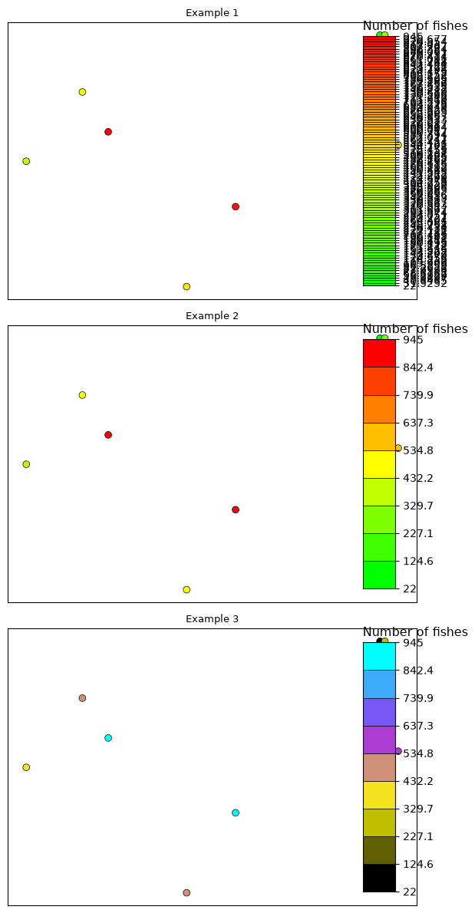

Adding colours to a grid with custom cuts (see also section 2.1's last
example):

```python
my_grid = cg.create_polygrids(grid_data, area=10000)
my_cuts = [0, 50, 100, 500, 2000, 2500]
grid_col = cg.add_colour(my_grid["Catch_sum"], cuts=my_cuts, cols=["blue", "white", "red"])

fig, ax = plt.subplots(figsize=(8, 6))
cgplot.basemap(ax=ax)
my_grid.plot(ax=ax, color=list(grid_col["varcol"]), linewidth=0.1)
cgplot.add_colour_scale(ax=ax, cuts=grid_col["cuts"], cols=grid_col["cols"], title="Sum of Catch (t)", size="10%")
plt.show()
```

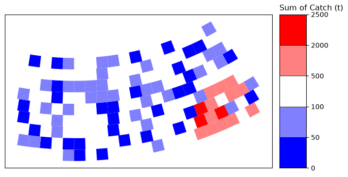

### 5.3. Adding legends

A colour scale plus a plain matplotlib legend for point symbols:

```python
my_points = cg.create_points(point_data)
bathy_cr = bathy_small.rio.clip_box(*(my_points.total_bounds + [-100000, -100000, 100000, 100000]))

fig, ax = plt.subplots(figsize=(8, 5))
cgplot.basemap(ax=ax)
bathy_cr.plot(ax=ax, cmap=depth_cmap, norm=depth_norm, add_colorbar=False)
cgplot.add_colour_scale(ax=ax, cuts=cg.DEPTH_CUTS, cols=cg.DEPTH_COLS, size="8%", loc="left")

markers = {"one": ("o", "red"), "two": ("s", "green"), "three": ("D", "blue"), "four": ("^", "yellow")}
for name, (marker, colour) in markers.items():
    sub = my_points[my_points["name"] == name]
    ax.scatter(sub["x"], sub["y"], marker=marker, color=colour, edgecolor="black", s=60, label=name)
ax.legend(title="Vessel", loc="lower right", fontsize=8, title_fontsize=9)
plt.show()
```

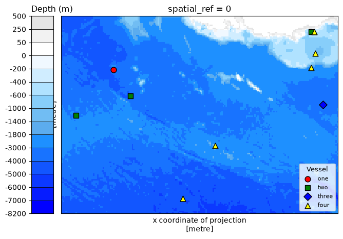

For a more complete and customisable legend, `add_legend()` supports six
shape types (`rectangle`, `circle`, `ellipse`, `line`, `arrow`, `none`)
with fill/border/hatch styling -- a from-scratch, matplotlib-native
reimplementation of R's ~680-line `add_Legend` (~30 tunable options across
9 named positions), built on matplotlib's own legend machinery instead
(`docs/porting_notes.md`):

```python
import geopandas as gpd
from shapely.geometry import box
from ccamlrgis.plot import LegendItem

bx = box(*asds.total_bounds)
items = [
    LegendItem("Rectangle 1", shape="rectangle", fill="cyan", border="blue", linewidth=2),
    LegendItem("Rectangle 2", shape="rectangle", fill="red", border="orange", linewidth=2, hatch="//"),
    LegendItem("Circle 1", shape="circle", fill="grey", border="yellow", linewidth=2),
    LegendItem("Circle 2", shape="circle", fill="white", border="red", linewidth=2, hatch="//"),
    LegendItem("Ellipse 1", shape="ellipse", fill="white", border="darkblue", linewidth=2),
    LegendItem("Ellipse 2", shape="ellipse", fill="red", border="green", linewidth=2, hatch="//"),
    LegendItem("Line 1", shape="line", fill="black", linewidth=5),
    LegendItem("Line 2", shape="line", fill="green", linewidth=5),
    LegendItem("Arrow 1", shape="arrow", fill="orange", border="green"),
    LegendItem("None", shape="none"),
]

fig, ax = plt.subplots(figsize=(8, 6.5))
cgplot.basemap(ax=ax)
gpd.GeoSeries([bx], crs=cg.CCAMLR_CRS).plot(ax=ax, color="grey")
asds.boundary.plot(ax=ax, color="black")
cgplot.add_legend(ax=ax, items=items, title="Legend", loc="lower right", fontsize=8)
plt.show()
```

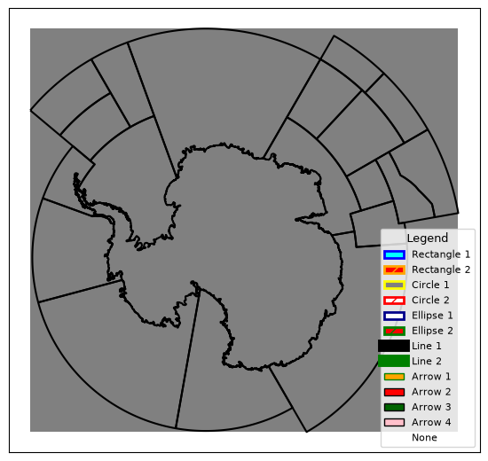

### 5.4. Adding labels

`add_labels()` has two modes in this port: `mode='auto'` labels the
centres of polygon parts of layers loaded via `load_*`; `mode='table'`
places labels from a table you build yourself (this port's replacement
for R's `mode='input'`). R's `mode='manual'` (click-to-place) has no
headless Python equivalent and is dropped (`docs/porting_notes.md`
deviation 2).

**Example 1** (`'auto'` mode): ASDs in bold red, MPAs/EEZs in large,
green, vertical text:

```python
fig, ax = plt.subplots(figsize=(8, 8))
cgplot.basemap(ax=ax)
asds.boundary.plot(ax=ax, color="black")
cgplot.add_labels(ax=ax, mode="auto", layer="ASDs", fontsize=7.5, fonttype=2, colour="red")
mpas = cg.load_mpas()
eezs = cg.load_eezs()
mpas.boundary.plot(ax=ax, color="green")
eezs.boundary.plot(ax=ax, color="green")
cgplot.add_labels(ax=ax, mode="auto", layer=["EEZs", "MPAs"], fontsize=10, colour="green", angle=90)
plt.show()
```

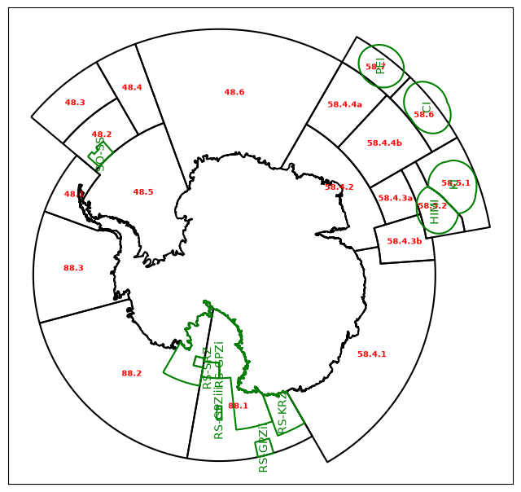

### 5.5. Using geopandas

Every `ccamlrgis` function that returns spatial data returns a plain
`geopandas.GeoDataFrame` -- normal pandas indexing/columns plus a
`geometry` column. geopandas' own `.plot()` (matplotlib-based) fills the
role of R's `sf`/`ggplot2` plotting methods:

```python
my_polys = cg.create_polys(poly_data)
my_polys
```

R's `plot(MyPolys)` facets every numeric column automatically (up to 9);
geopandas has no direct one-liner for that, so it's done explicitly here
for a representative subset of columns:

```python
facet_cols = ["Catch_mean", "Catch_sum", "Nfishes_mean", "AreaKm2", "Catch_sd", "n_count"]
facet_cols = [c for c in facet_cols if c in my_polys.columns][:6]

fig, axes = plt.subplots(2, 3, figsize=(11, 6))
for ax, col in zip(axes.flat, facet_cols):
    my_polys.plot(column=col, ax=ax, legend=True, cmap="viridis")
    ax.set_title(col, fontsize=9)
    ax.set_xticks([])
    ax.set_yticks([])
fig.tight_layout()
plt.show()
```

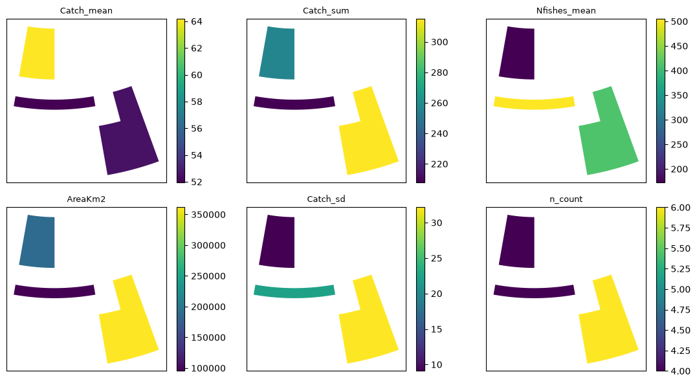

`plot(MyPolys["Catch_mean"])`: a single named column, with a graticule
(`add_reference_grid`, this port's equivalent of `st_graticule`) instead
of R's key/axes styling:

```python
fig, ax = plt.subplots(figsize=(8, 6))
my_polys.plot(column="Catch_mean", ax=ax, legend=True, cmap="viridis")
cgplot.add_reference_grid(ax=ax, res_lat=2.5, res_lon=5, fontsize=7)
ax.set_xticks([])
ax.set_yticks([])
plt.show()
```

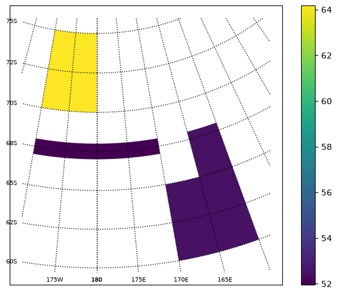

R's `ggplot2`/`gridExtra` multi-panel example has a direct geopandas +
matplotlib-subplots equivalent -- no extra plotting library needed:

```python
fig, axes = plt.subplots(1, 3, figsize=(13, 4.5))
my_polys.plot(column="Catch_mean", ax=axes[0], legend=True, cmap="viridis")
axes[0].set_title("Mean catch")
my_polys.plot(column="Catch_sd", ax=axes[1], legend=True, cmap="viridis")
axes[1].set_title("S.D. of catch")
my_polys.plot(column="AreaKm2", ax=axes[2], legend=True, cmap="viridis")
axes[2].set_title("Polygon area")
for ax in axes:
    ax.set_xticks([])
    ax.set_yticks([])
fig.tight_layout()
plt.show()
```

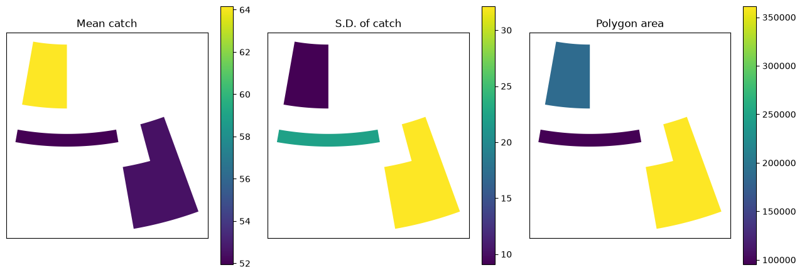

## Geospatial rules and citations

CCAMLR's [geospatial
rules](https://github.com/ccamlr/geospatial_operations#1-geospatial-rules)
(endorsed by the Scientific Committee, SC-CAMLR-42 para 2.30) are encoded
as code, not just documentation:

```python
from ccamlrgis.validate import check_geospatial_rules

report = check_geospatial_rules(my_polys)
report.ok       # True/False
print(report)   # lists every violation, if any
```

Every `load_*` layer carries its rule-8 citation string automatically:

```python
asds.attrs["citation"]
# 'CCAMLR. (2026). Geographical data layer: ASDs. Version 2026, URL: ...'
```

## Where to go next

- **`notebooks/`** -- this tutorial as six executable, tested Jupyter
  notebooks (`01_basemaps.ipynb` ... `06_colours_legends_labels.ipynb`),
  covering every static figure in the R package's README.
- **`docs/r_to_python.md`** -- the complete R-to-Python function and
  argument mapping.
- **`docs/porting_notes.md`** -- every intentional behavioural deviation
  from the R package, with reasoning and impact.
- **`PROGRESS.md`** -- the dated development log.

## Development setup

```
mamba env create -f environment.yml
mamba activate ccamlrgis-py
pytest
```
